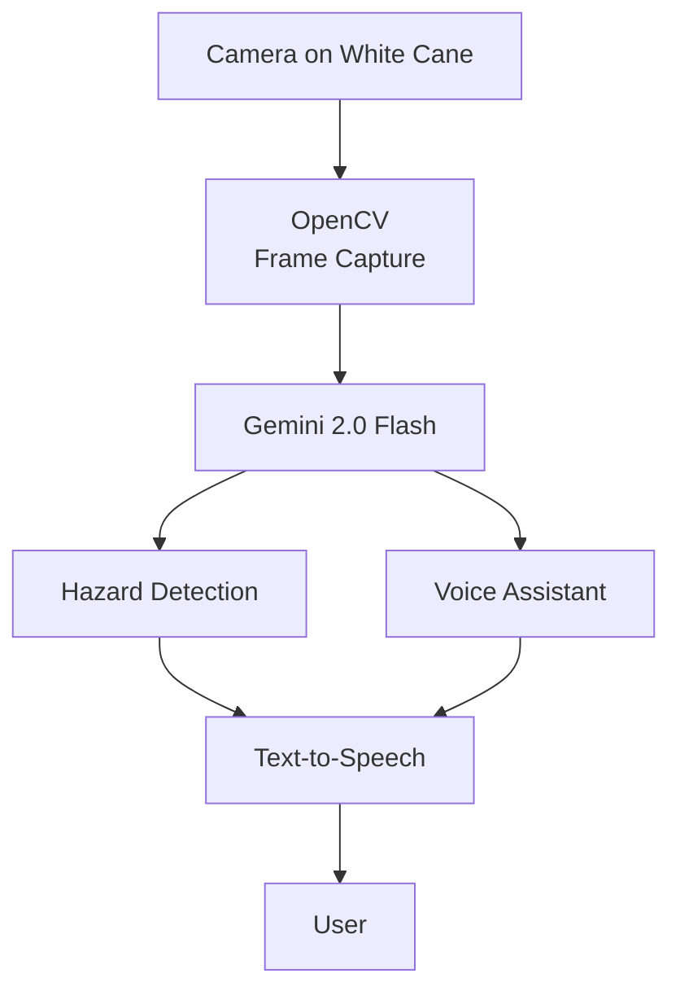

# S.A.R.A.H.

### Safety Assistant for Real-time Awareness and Hazard Detection

A multimodal AI assistive system combining real-time environmental
hazard detection with a voice-controlled visual assistant for people
with visual impairments.

## Demo Video

**[▶ Watch the full S.A.R.A.H. prototype demo on YouTube →](https://youtu.be/WMObGMByjl4)**

## The Problem

Existing mobility aids help people with visual impairments navigate more
independently, but each comes with important limitations.

Through my literature review, I became particularly interested in the
advantages of sighted guides. Unlike a traditional assistive device, another
person can both proactively warn someone about hazards and respond flexibly
to questions about anything in the surrounding environment.

The problem is that relying on continuous sighted assistance limits
independence and is not always practical or accessible.

This became the central design inspiration for S.A.R.A.H.:

> **Could multimodal AI provide some of the contextual environmental
> assistance of a sighted guide without requiring another person to
> constantly be present?**

S.A.R.A.H. explores this idea through two complementary capabilities:

1. **Proactive hazard detection** — identify potential obstacles and alert
   the user without requiring them to ask.

2. **On-demand environmental assistance** — allow the user to ask open-ended
   questions about their surroundings, such as identifying objects,
   landmarks, signs, or text.

This distinction shaped the decision to use a visual-language model rather
than a conventional object detector. Instead of recognizing only a
predefined set of object classes, the system could interpret an entire scene
and respond to a much wider range of environmental questions.

## How It Works

The hazard pipeline periodically analyzes the user's surroundings and
announces relevant obstacles.

When the user says "Sarah," the conversational pipeline receives
priority, captures the current camera frame, and answers questions
about the environment.

## Engineering Challenge: Managing Competing Audio

One of the largest implementation challenges was allowing an
on-demand voice query to interrupt continuous hazard announcements.

The prototype uses concurrent speech recognition and environmental
monitoring, with explicit control over text-to-speech execution so
user questions can take priority over background hazard detection.

## Evaluation

The prototype was evaluated through a preliminary three-person pilot
study across indoor and outdoor environments.

Evaluation categories included:

- Head-level hazards
- Body-level hazards
- Floor-level hazards
- Landmark identification
- Environmental Q&A
- Text reading
- False positives
- False negatives

The system received scores of at least 4/5 across hazard-detection
categories. False positives emerged as the primary area requiring
future improvement.

> This was a small exploratory pilot and did not include visually
> impaired participants. Results should not be interpreted as a
> clinical or safety validation.

## Tech Stack

Python · OpenCV · Gemini 2.0 Flash · SpeechRecognition · pyttsx3 ·
Multithreading

## Research

S.A.R.A.H. was developed as part of an independent research project
with mentorship from Dr. Nakul Gopalan, an assistant professor at
Arizona State University's School of Computing and Augmented Intelligence.

The project included literature review, system design, implementation,
prompt engineering, prototype testing, and evaluation.

## Future Work

- Reduce unnecessary hazard alerts
- Add depth-aware spatial reasoning
- Personalize alerts based on user preferences
- Move inference onto portable hardware
- Add offline functionality
- Conduct accessibility testing with visually impaired participants
